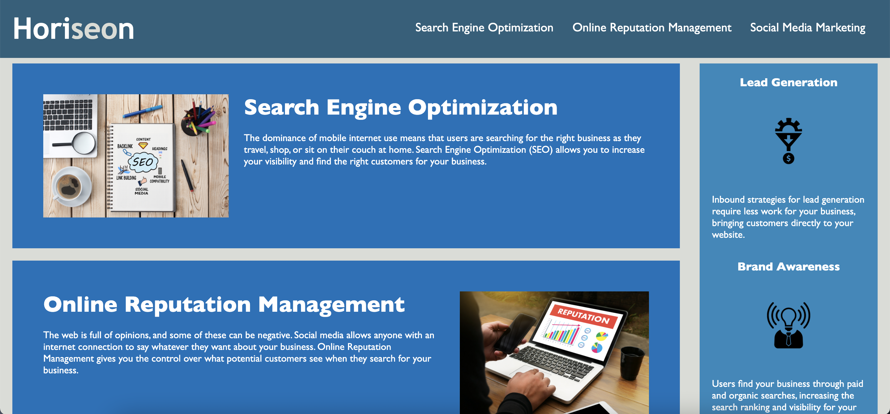

# Code Refractor Homework W1

## Refractoring Horiseon's Landing Page

**Description**

The following is the modifications that have been made to meet the accessibility standards and refractor the landing page of Horiseon:

1. Edited semantic HTML elements - most of non-semantic elements have been replaced with semantic elemtns such as <header>, <section>, <aside>, and <footer> to clearly identify the purpose of the contents. 

2. Edited the sequence of headings in respective order. You will find that tags of headings are in <h1> to <h4> order. 

3. Added accessible alt attributes for each image source to specify alternative texts for the images in case of the images not being displayed on the website. 

4. Organised the sectors and properties in the CSS file to follow the HTML semantic structure. 

5. Replaced the name of "header" class to "navbar" to clearly specify the actual nav bar on the website. 

6. Added a missing id in line #31 <section id="search-engine-optimization"> 

7. Set the position of the navbar to be fixed on the website. 

8. Organised the spacing and indentation of the code.

9. Modified the title to describe the landing page more concisely. 

**Screenshot of the image**

**Link to deployed application**

For the URL of the deployed application: <https://hzzrin.github.io/w1_Hyerin_Horiseon_collabo/>

For the live website: <https://hzzrin.github.io/w1_Hyerin_Horiseon_collabo/Develop%20copy/index.html>
